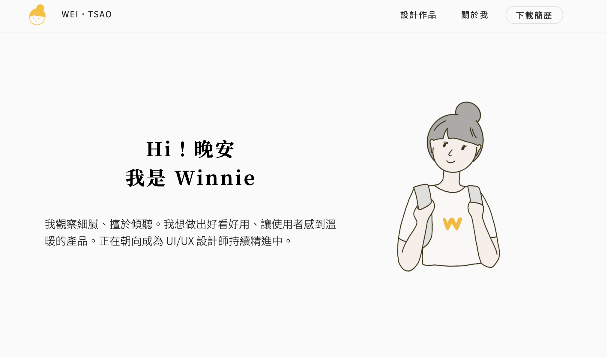

# portfolio-weitsao

<p align="center">
    <a href="https://weitsao.com" target="_blank">
        weitsao.com
    </a>
</p>

<p align="center">
    <a href="https://app.netlify.com/sites/weichenghung/deploys" target="_blank">
        
    </a>
</p>



This is my love's portfolio which is designed by [weitsao.com](https://weitsao.com). It's my duty to accomplish it with honor and joy.

## 🛠️ Build Setup

```bash
# install dependencies
$ yarn install

# serve with hot reload at localhost:3000
$ yarn dev

# build for production and launch server
$ yarn build
$ yarn start

# generate static project
$ yarn generate
```

For detailed explanation on how things work, check out [Nuxt.js docs](https://nuxtjs.org).

## 🎨 Color Reference

| Color                    | Hex                                                                |
| ------------------------ | ------------------------------------------------------------------ |
| Primary Color            |  `#F9BF45` |
| Primary Light            |  `#FAD689` |
| primary Dark             |  `#C28F06` |
| Secondary01 (Background) |  `#FAFAFA` |
| Secondary02              |  `#E0E0E0` |
| Secondary03              |  `#757575` |
| Secondary04              |  `#212121` |

## Developing Tips

- When you try to pass img url string as props to a component, the props you need to pass as
  `require('~/assets/img/metro-cover.png')`
- Use throttle from lodash to reduce the loading of onScroll event.
